# 就医小程序生成底层逻辑文档

## 一、第一页显示内容

### 1. 就诊取号方式
页面需显示三个按钮，分别为：
* **身份证**
* **社保卡**
* **电子医保**

### 2. 电子医保码调取路径展示
若用户选择电子医保，需展示以下调取路径说明：
1.  微信搜索“国家医保”小程序，点击进入。
2.  点击右下角“我的”，授权登录。
3.  登录成功，点击首页右上角二维码图片，生成医保码，可扫码使用。
*(此处需附带示例图片，显示国家医保服务平台界面)*

### 3. 温馨提示
页面底部需显示温馨提示：
> “请携带好既往就诊资料及影像资料（如有），并提前就诊时间30分钟到达医院，完成取号，等待就诊。”

## 二、第二页显示内容（点击下一步进入）

### 1. 页面开头
展示提示语：“**请选择您本次的既已就诊医院、就诊科室**”

### 2. 医院选择按钮
展示三个按钮，医院名字用不同颜色区分以增加美观性：
* **深圳市第二人民医院**
* **广州中医药大学深圳医院**
* **北京大学深圳医院**

### 3. 科室分类与列表
点击对应医院按钮后，出现该医院的科室列表。科室分为**外科类、内科类、检查类、其他**四种（需重点显示）。

#### (1) 深圳市第二人民医院
* **内科类**：消化内科、血液内科、综合内科、心血管内科、肾内科、内分泌科、神经内科、妇科、风湿免疫科、全科医学科、老年医学科、儿科、呼吸与危重学科
* **外科类**：神经外科、肛肠外科、泌尿外科、烧伤科、创面修复科、整形美容科、皮肤科、耳鼻咽喉科、口腔科、肿瘤科、产科、针灸推拿科
* **检查类**：检验科、门诊抽血室、医学影像科(X光)、医学影像科(CT)、磁共振(MRI)、超声科(B超)、心电图、动态心电图、动态血压、肌电图、脑电图、TCD
* **其他**：用药咨询处、医保咨询处、客服中心、挂号收费处、中/西医药房

#### (2) 广州中医药大学深圳医院
* **内科类**：内科、全科医学科、儿科、妇科
* **外科类**：骨伤科、外科、肛肠科、皮肤科、眼科、耳鼻喉科、口腔科、产科
* **检查类**：心电图、脑电图、肌电图、TCD室(经颅多普勒超声)、胃肠镜室
* **其他**：药房、挂号收费处、客户服务中心

#### (3) 北京大学深圳医院
* **内科类**：内科、神经内科、妇科、妇科内分泌科、儿科、营养门诊
* **外科类**：外科、泌尿外科、眼科、美容整形外科、耳鼻咽喉科、皮肤科
* **检查类**：急诊CT/X线、妇科超声室、检验科、生殖彩超室、操作治疗区(抽血、换药、注射、雾化)
* **其他**：门诊便民服务中心、国际医疗部、收费处、中药房、西药房

## 三、深圳市第二人民医院科室导航指引（点击科室后显示）

当用户点击“深圳市第二人民医院”下的具体科室时，需展示对应的实景照片及文字指引。

## 三、深圳市第二人民医院科室导航指引（点击科室后显示）

**(1) 外科**

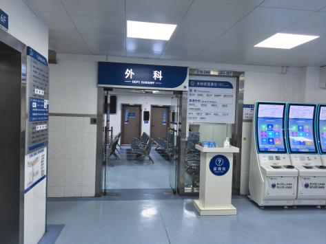

导航指引：二楼电梯出口左转

**(2) 烧伤科**
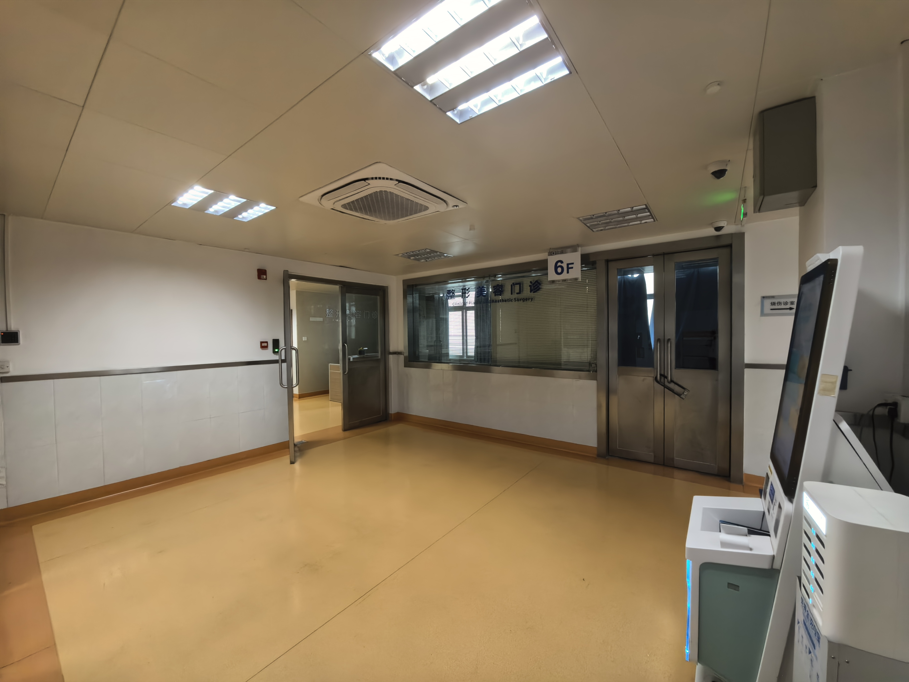
导航指引：六楼电梯出口右转

**(3) 整形美容科**

导航指引：六楼电梯出口左转

**(4) 皮肤科、儿科**
导航指引：三楼电梯出口向左前方直行，后右转

**(5) 耳鼻咽喉科**
导航指引：五楼电梯出口向左前方直行，后右转

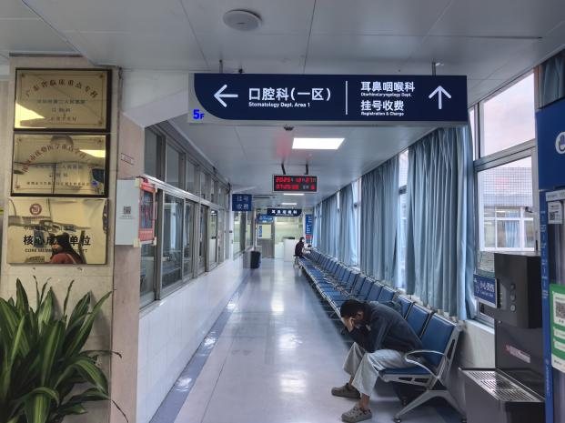

**(6) 口腔科**
导航指引：五楼电梯出口向左转为口腔一区，向右转为口腔二区

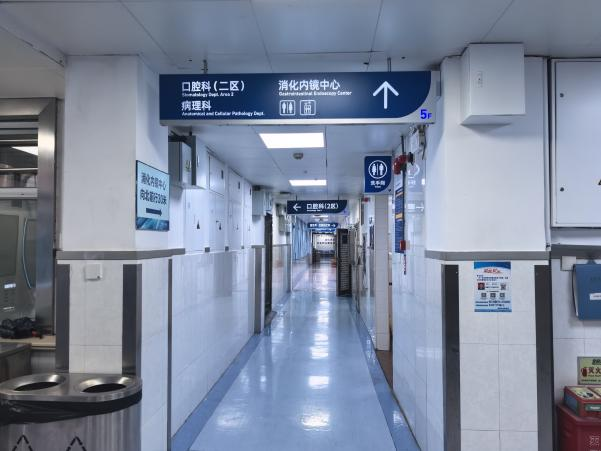

**(7) 肿瘤科、泌尿外科、肾内科**
导航指引：四楼电梯出口右前方诊室

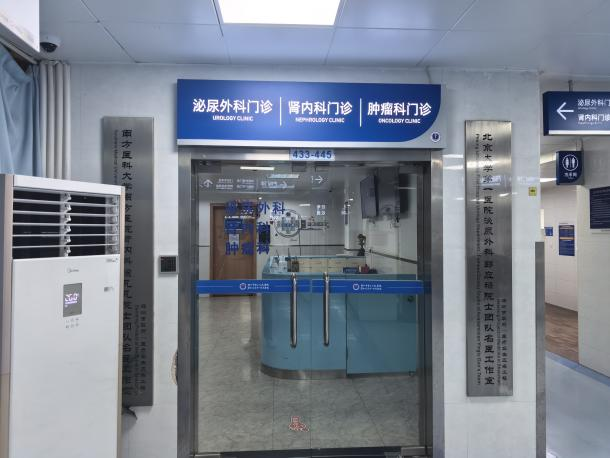

**(8) 产科**
导航指引：四楼电梯出口左侧诊室

**(9) 针灸推拿科**
导航指引：三楼电梯出口右侧通道的左侧诊室

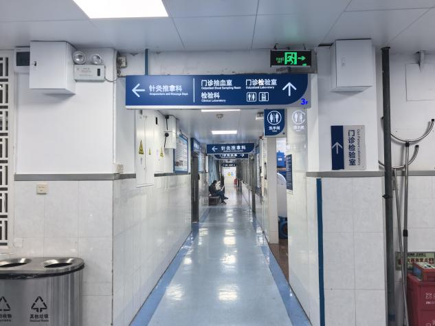

**(10) 消化内科、血液内科**
导航指引：二楼电梯出口左前方通道到底右转

**(11) 心血管内科、心电图、动态心电图、动态血压**
导航指引：二楼电梯出口右前方诊室

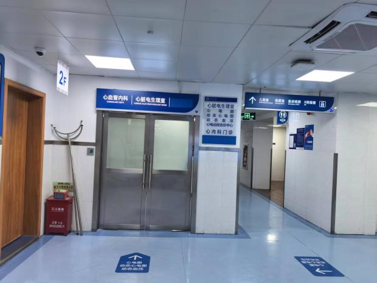

**(12) 呼吸与危重学科、风湿免疫科、老年医学科、综合内科、全科医学科**
导航指引：医院门诊楼正门进入后右转直行，左侧诊室

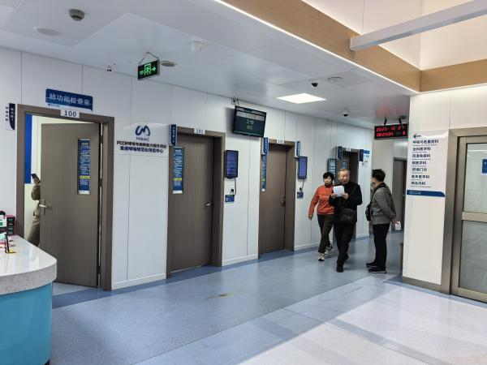
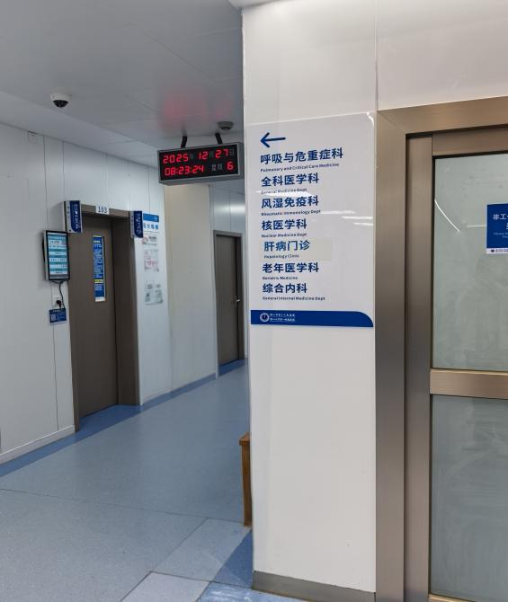

**(13) 内分泌科**
导航指引：四楼电梯出口右侧通道左侧诊室

**(14) 神经内科、神经外科、脑电图、肌电图、TCD**
导航指引：四楼电梯出口左前方通道到底右转

**(15) 检验科**
导航指引：三楼电梯出口右侧通道到底右转

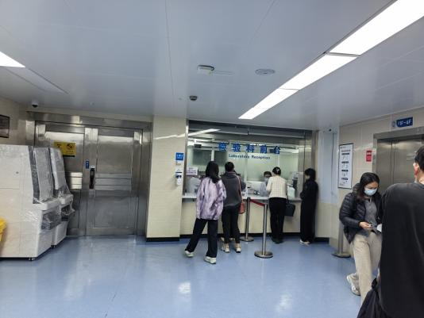

**(16) 门诊抽血室**
导航指引：三楼电梯出口右侧通道右侧诊室

**(17) 医学影像科 (X光)**
导航指引：二楼电梯出口右侧通道到底

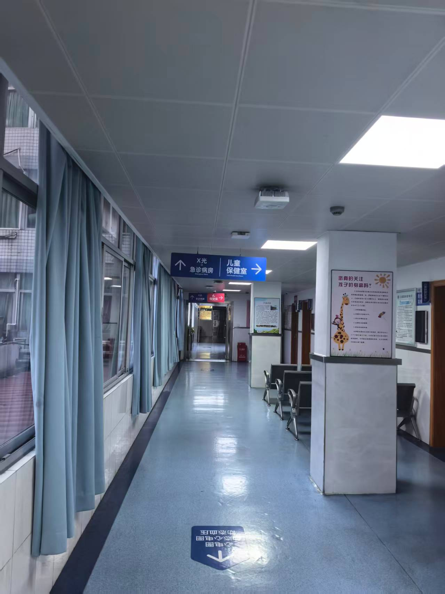

**(18) 医学影像科 (CT)**
导航指引：医院门诊楼正门进入直行左侧诊室
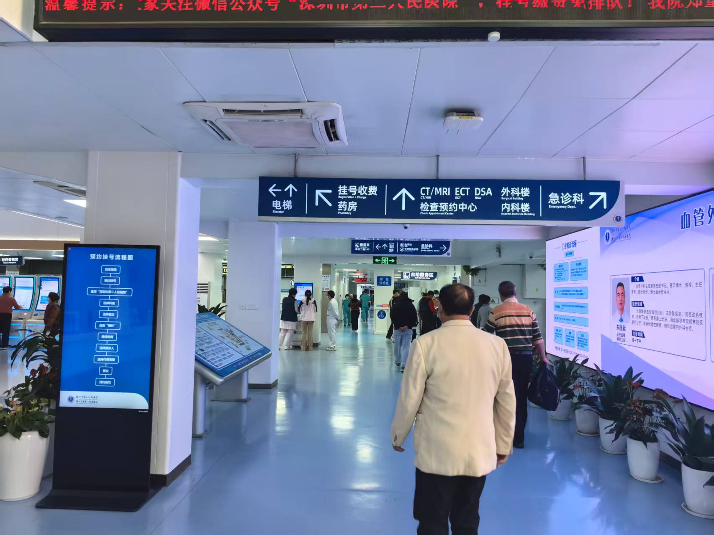
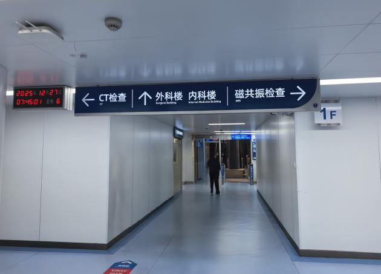

**(19) 磁共振 (MRI)**
导航指引：医院门诊楼正门进入直行至后门，步出门诊楼左转进入外科楼，乘坐右手侧扶梯至二楼后左转

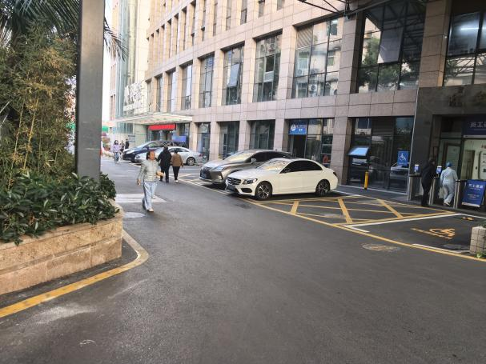
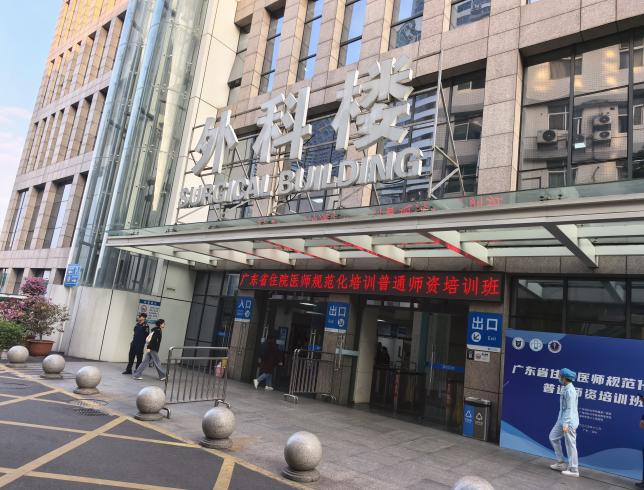
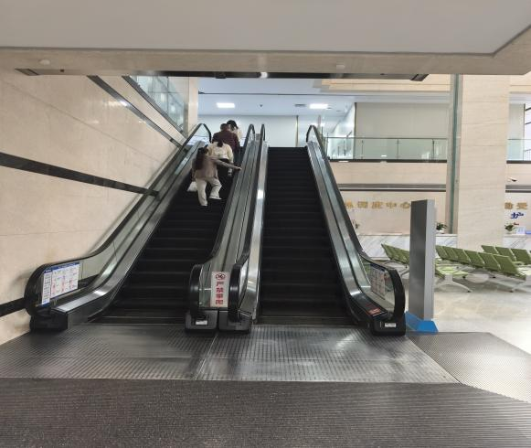
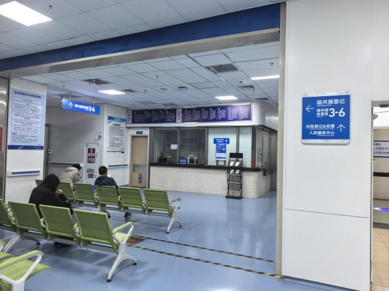

**(20) 超声科 (B超)**
导航指引：四楼电梯出口右侧通道到底

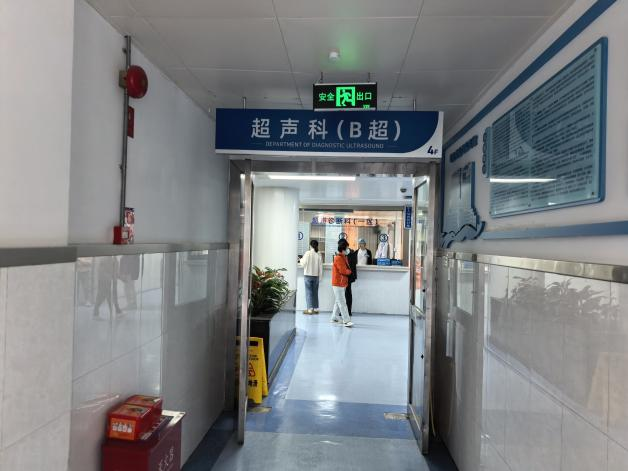

**(21) 挂号收费处**
导航指引：医院门诊楼正门进入右侧为自助/人工挂号收费处
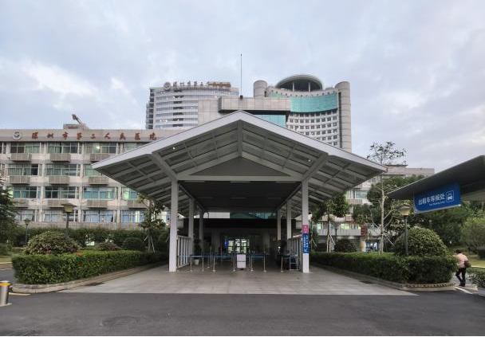

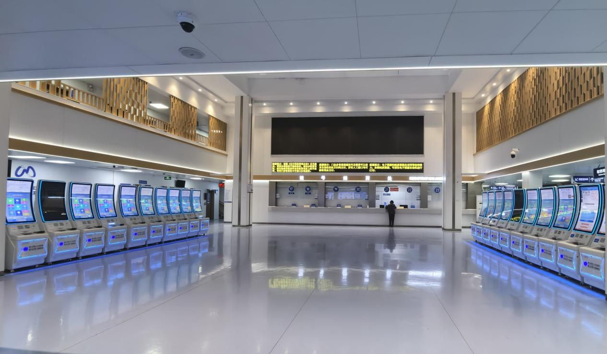

**(22) 药房**
导航指引：医院门诊楼正门进入步行，直行至通道十字交叉处右转

